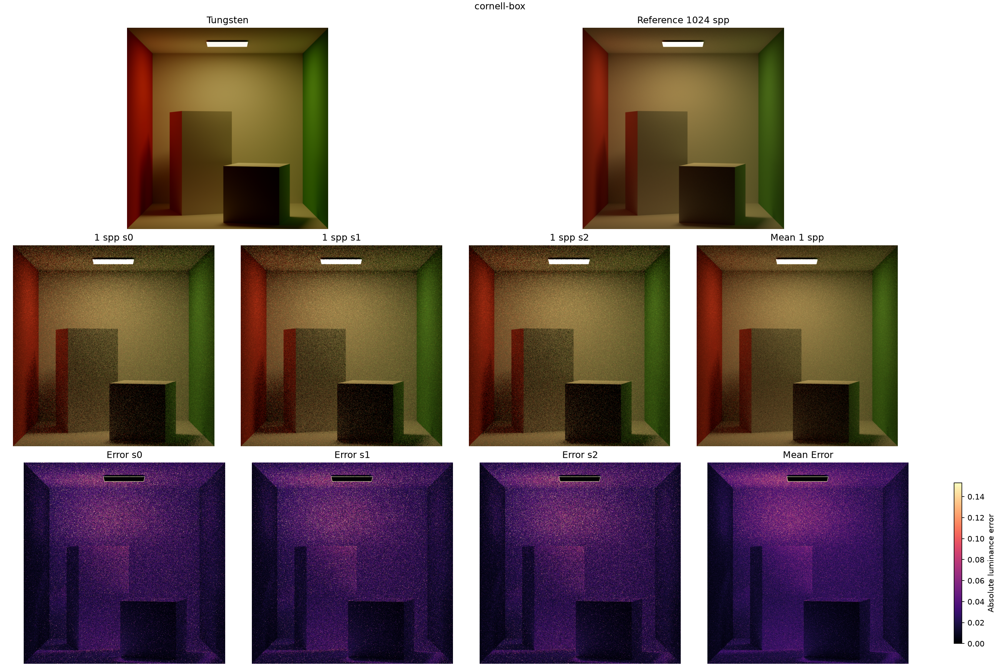
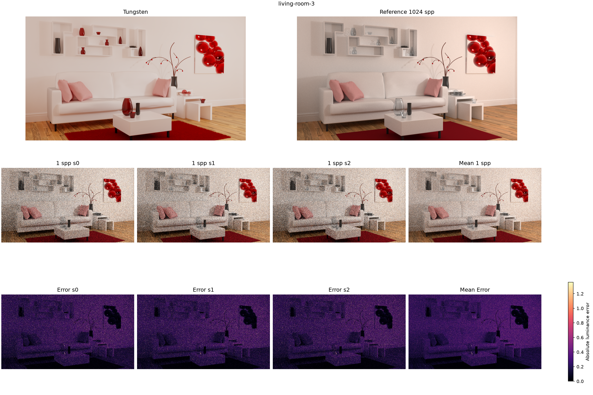
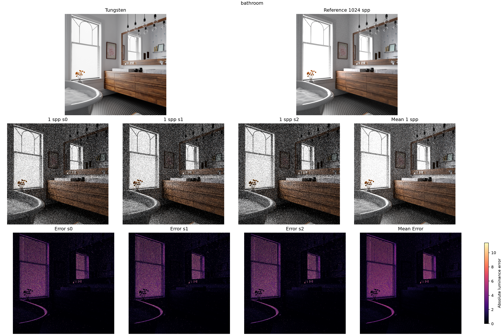
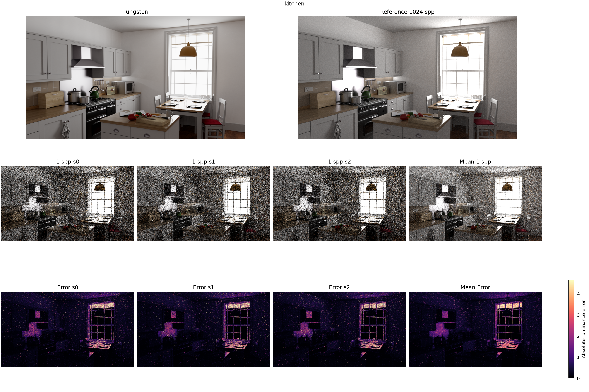
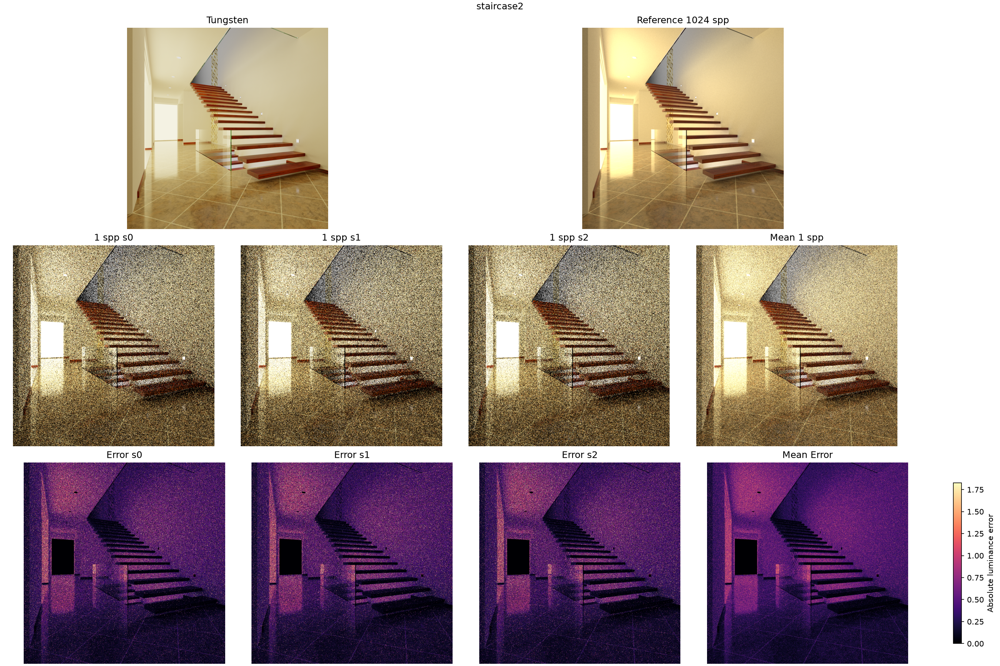
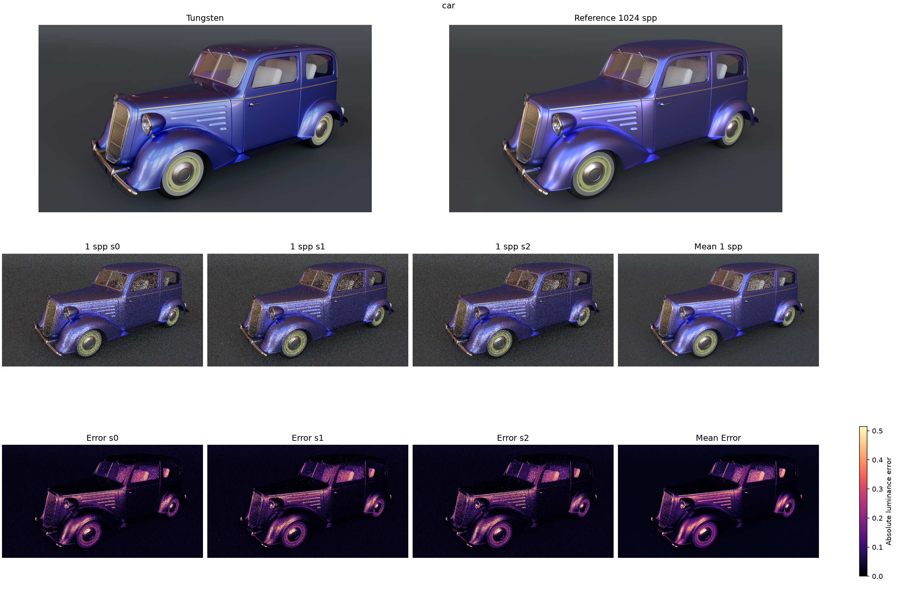
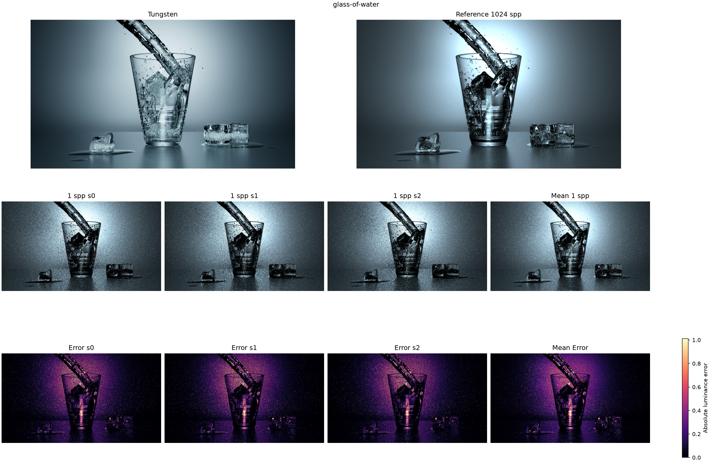
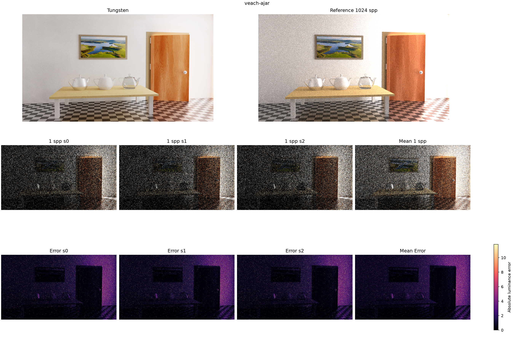
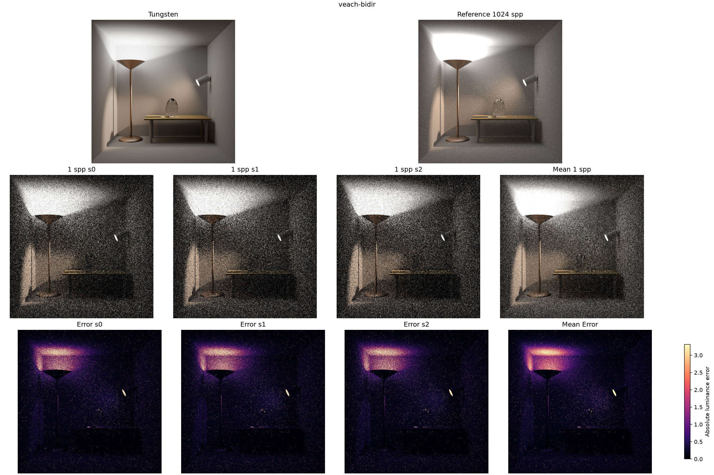
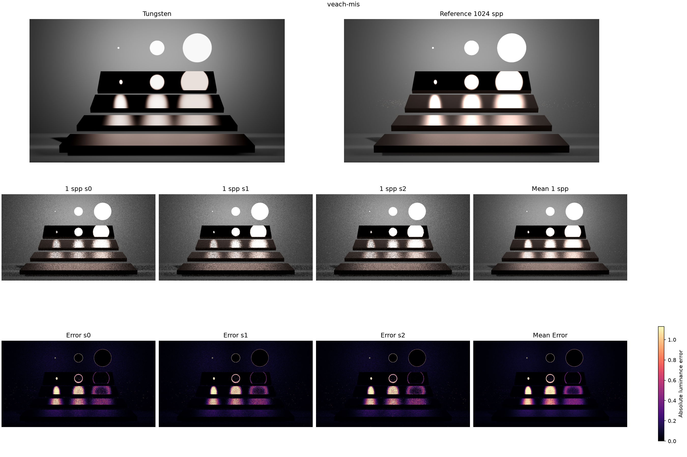

# EXP-01: 1-spp Path Tracing Failure Visualization

date: 2026-09-23

## 1. Cornell-Box

Cornell Box에서는 1 spp로 렌더링했을 때 세 seed 모두 장면 전체에 강한 Monte Carlo noise가 나타났다. 이건 예상했던 결과로, sample 수가 1개뿐이라 Path Tracing의 variance가 충분히 줄어들지 못했기 때문이다. 그런데 absolute error map을 보면 한 가지 특이한 점이 있다. 천장의 area light와 가까운 위쪽 벽으로 갈수록 error가 더 크게 나타난다.

다만 이걸 바로 광원에 가까울수록 variance가 커진다고 해석하기는 어렵다. 단순히 그 영역의 radiance 자체가 높아서 absolute error도 같이 커졌을 가능성이 있기 때문이다. 또한 세 seed에서 noise의 세부 위치는 다르지만, 밝은 영역에서 error가 커지는 전체적인 패턴은 반복된다.

따라서 다음 실험에서는 이 현상이 단순히 밝은 영역이라 error가 커 보이는 것인지, 아니면 실제로 light 근처에서 sampling variance가 더 커지는 것인지 분리해서 확인할 필요가 있다.

## 2. Living Room

1 spp에서는 장면 전체에 고주파 noise가 발생하며, 특히 밝은 벽과 소파처럼 radiance가 높은 diffuse 영역에서 absolute error가 크게 나타난다. 3 seed를 평균하면 전체 조명 구조가 빠르게 reference에 가까워지므로, 특정 path를 못 찾는 문제보다는 일반적인 sampling variance가 주된 원인으로 보인다.

Cornell Box와 비슷하게 밝은 영역에서 error가 커지는 현상이 반복된다. 실제 장면처럼 geometry와 material이 더 복잡한데도 Cornell Box와 비슷한 pattern이 나온다는 점은 흥미롭다.

따라서 밝은 diffuse 영역에서 나타나는 높은 error가 단순 radiance-scale effect인지, 실제 variance 증가인지 여러 장면에서 공통적으로 확인해볼 필요가 있다.

## 3. Bathroom

1 spp에서는 전체적으로 noise가 강하지만, 특히 창문 주변과 욕조 테두리처럼 강한 조명 변화와 반사 성분이 있는 영역에서 error가 크게 나타난다. 어두운 실내 영역보다 밝은 창문 근처에서 error가 반복적으로 커지는 점은 앞 장면들과 비슷하다.

흥미로운 점은 거울 자체의 error는 상대적으로 작지만, 거울에 반사된 창문과 강한 빛 영역에서는 error가 매우 크게 나타난다는 것이다. 즉 specular surface 자체가 항상 어려운 것이 아니라, specular reflection을 통해 높은 radiance 영역과 연결될 때 문제가 더 커지는 모습이 보인다.

이 부분은 단순한 reflection 문제가 아니라, specular path와 강한 light contribution이 결합될 때 variance가 어떻게 변하는지 확인해볼 필요가 있다.

## 4. Kitchen

1 spp에서는 창문과 주변 벽처럼 강한 외부광의 영향을 받는 영역에서 error가 크게 나타나며, 어두운 실내 영역은 상대적으로 error가 작다. 전체적으로는 diffuse noise가 지배적이지만, 창문 근처처럼 radiance와 visibility 변화가 큰 영역에서 error가 더 집중된다.

추가적으로 흥미로운 점은 창문 전체가 밝음에도 불구하고 창문의 중앙 영역에서는 오히려 error가 낮게 나타난다는 것이다. 즉 단순히 radiance가 높다고 해서 항상 error가 높은 것은 아니다.

창문의 경계나 주변 geometry와 만나는 부분에서 error가 더 커지는 것으로 보이기 때문에, visibility 변화나 light sampling geometry가 영향을 주는지 확인할 필요가 있다.

## 5. Staircase2

1 spp에서는 왼쪽의 매우 강한 광원과 그 영향을 받는 벽 주변에서 error가 크게 나타난다. 반대로 어두운 계단과 내부 영역은 상대적으로 error가 작게 측정된다.

이 장면도 밝은 영역에서 absolute error가 커지는 경향을 보이지만, 빛이 좁은 개구부를 통해 들어오고 여러 표면에 간접적으로 전달된다는 특징이 있다. 따라서 단순히 밝아서 error가 큰 것인지, 아니면 제한된 light path와 indirect transport 때문에 variance가 증가하는 것인지 구분할 필요가 있다.

특히 광원에서 멀어지면서 indirect illumination이 형성되는 영역의 error가 어떻게 변화하는지 보는 것이 중요해 보인다.

## 6. Car

1 spp에서는 차체의 넓은 glossy/specular surface와 강한 highlight 주변에서 error가 크게 나타난다. 특히 곡면을 따라 반사되는 밝은 영역에서 error가 집중되며, 단순 diffuse noise와는 다른 pattern을 보인다.

이는 specular reflection 방향이 조금만 달라져도 sample이 전혀 다른 radiance를 가져올 수 있기 때문일 가능성이 있다. 흥미로운 점은 모든 glossy 영역이 동일하게 어렵지는 않고, 강한 environment reflection이나 highlight가 형성되는 부분에서 error가 더 집중된다는 것이다.

따라서 roughness, reflection direction, incoming radiance의 변화가 variance에 각각 얼마나 영향을 주는지 확인해볼 필요가 있다.

## 7. glass-of-water

1 spp에서는 유리와 물 주변에서 error가 매우 크게 나타나며, 특히 굴절된 빛과 caustic이 형성되는 영역에서 reference와 큰 차이를 보인다. 이건 단순한 diffuse variance보다는 specular reflection/refraction을 거친 light path를 기본 Path Tracing이 잘 발견하지 못하는 문제에 가깝다.

특히 중요한 점은 단순히 유리 표면이 noisy한 것이 아니라, specular event를 거쳐 다른 표면에 전달되는 빛에서 큰 error가 발생한다는 것이다. 즉 이 장면은 path contribution 자체는 크지만 sampling probability가 낮은 경로가 존재할 가능성이 높다.

따라서 specular transport discovery 문제를 분석하기에 좋은 대표 장면으로 보인다.

## 8. Veach-Ajar

1 spp에서는 좁은 틈이나 개구부를 통해 들어오는 강한 빛 주변에서 error가 크게 나타난다. 특히 빛이 직접 보이지 않고 제한된 경로를 통해 실내로 전달되는 영역에서 reference와 차이가 커진다.

이 장면의 중요한 특징은 광원이 매우 강하더라도 실제로 빛이 통과할 수 있는 방향이나 위치가 제한되어 있다는 점이다. 따라서 대부분의 sample은 contribution이 작거나 0에 가깝지만, 드물게 중요한 path를 찾으면 매우 큰 contribution을 얻을 가능성이 있다.

이런 구조가 실제로 존재한다면 rare high-contribution path와 visibility 문제를 분석하기 좋은 장면이다.

## 9. Veach-Bidir

1 spp에서는 작은 광원과 그 빛이 여러 표면을 거쳐 전달되는 영역에서 error가 크게 나타난다. 특히 직접적으로 찾기 어려운 indirect/specular transport에서 reference와 차이가 커지며, 이는 camera에서 시작하는 일반 Path Tracing이 특정 중요한 light path를 낮은 확률로 발견하기 때문일 가능성이 있다.

이 장면에서는 단순히 sample 수가 적다는 문제보다, sampling을 어느 방향에서 시작하는가가 중요한 문제일 수 있다. 즉 camera subpath에서는 찾기 어려운 경로가 light subpath에서는 훨씬 쉽게 발견될 가능성이 있다.

따라서 light path discovery와 bidirectional sampling의 필요성을 확인하기 좋은 장면으로 보인다.

## 10. Veach-MIS

1 spp에서는 서로 다른 roughness를 가진 glossy surface와 강한 highlight 주변에서 error가 집중된다. 동일한 광원이라도 material에 따라 BSDF sampling과 light sampling 중 어느 쪽이 유리한지가 달라지기 때문에, 낮은 sample 수에서는 sampling strategy의 mismatch가 크게 나타날 수 있다.

특히 roughness가 변하면서 error pattern도 달라지는 점이 중요한 특징이다. 이는 하나의 sampling strategy가 모든 material과 lighting configuration에서 항상 좋은 것은 아니라는 것을 보여준다.

따라서 BSDF sampling과 light sampling의 PDF가 실제 integrand와 얼마나 잘 맞는지, 그리고 MIS가 어느 상황에서 높은 variance를 남기는지 확인해볼 필요가 있다.