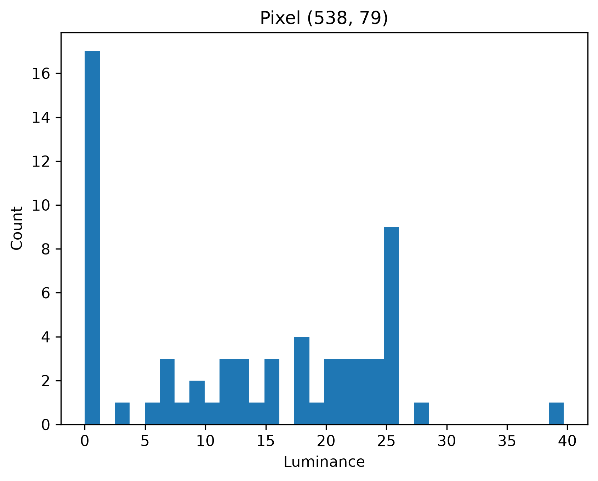
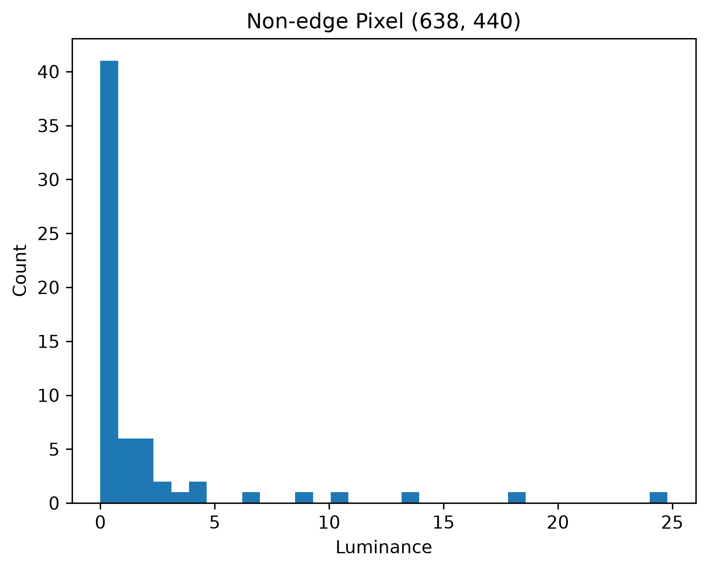

# EXP02 Error Analysis and Finding Feature

## 1. 실험 목적

EXP01에서는 1-spp Path Tracing 결과에서 장면에 따라 큰 error가 발생하는 것을 확인했다. 이번 실험에서는 단순히 이미지에서 noise를 관찰하는 것이 아니라, 1-spp에서 variance가 큰 pixel을 찾고, 실제로 어떤 sample과 어떤 light path가 해당 variance를 만드는지 직접 따라가 본다. 실험은 glass-of-water 장면에서 진행하였다.

| 항목 | 설정 |
| --- | --- |
| Scene | glass-of-water |
| SPP | 1 |
| Independent Seeds | 64 |
| Max Depth | 10 |
| RR Depth | 100 |

Russian Roulette의 영향을 제외하기 위해 RR Depth를 100으로 설정하였다.

## 2. Pixel Variance

먼저 동일한 장면을 서로 다른 64개의 seed를 사용하여 1-spp로 렌더링하였다. 각 결과를 luminance로 변환한 다음 pixel별 variance를 계산하였다.

전체 이미지에서 가장 variance가 큰 pixel은 다음과 같았다.

| 항목 | 값 |
| --- | ---: |
| Pixel | (538, 79) |
| Mean | 13.32429 |
| Std | 10.150726 |
| Min | 0.0 |
| Max | 39.69943 |

해당 pixel에서 64개의 sample이 어떤 분포를 가지는지도 확인하였다.

하지만 가장 variance가 큰 pixel을 단순히 선택하면 object boundary나 visibility edge와 같이 camera sampling에 민감한 영역이 선택될 수 있다. 따라서 이것만 가지고 light transport 자체의 문제라고 판단하기는 어렵다.

## 3. Image Edge 제거

이 영향을 줄이기 위해 64개 sample의 mean image에서 gradient를 계산하였다. Gradient가 큰 상위 10%의 영역을 제외한 후 다시 variance가 가장 큰 pixel을 찾았다.

Edge를 제외한 이후에도 높은 variance를 가지는 영역이 남아 있었다. 가장 variance가 큰 non-edge pixel은 다음과 같았다.

| 항목 | 값 |
| --- | ---: |
| Pixel | (638, 440) |
| Mean | 1.9729043 |
| Std | 4.351804 |
| Min | 0.0 |
| Max | 24.788425 |

해당 pixel의 sample distribution은 다음과 같다.

Mean은 약 1.97이지만 standard deviation은 약 4.35로 mean보다 훨씬 크다. 또한 모든 sample이 비슷한 값을 가지는 것이 아니라 일부 seed에서 훨씬 큰 contribution이 발생하였다. 상위 sample은 다음과 같았다.

| Seed | Luminance |
| ---: | ---: |
| 35 | 24.788425 |
| 0 | 18.457499 |
| 13 | 13.445436 |
| 3 | 10.598495 |
| 10 | 8.799867 |
| 41 | 6.368931 |
| 43 | 4.465406 |
| 1 | 4.333838 |
| 54 | 3.595893 |
| 37 | 2.768632 |

이 중 가장 큰 contribution을 가지는 seed 35와 가장 작은 seed 5를 비교하였다.

| Seed | Luminance |
| ---: | ---: |
| 35 | 24.788425 |
| 5 | 0.0 |

즉 같은 pixel에서 어떤 path가 sample되는지에 따라 결과가 크게 달라진다.

## 4. Primary Ray 비교

먼저 두 seed가 처음부터 완전히 다른 surface를 보고 있는지 확인하였다.

| Seed | Position | Normal |
| ---: | --- | --- |
| 35 | (-0.016994, 2.119610, 1.454565) | (-0.011665, -0.127709, 0.991741) |
| 5 | (-0.014277, 2.118577, 1.454515) | (-0.009800, -0.126215, 0.991940) |

두 primary intersection의 position과 normal은 매우 유사하였다. 따라서 0과 24.788425라는 큰 차이는 primary ray가 완전히 다른 surface를 바라본 결과라기보다는, 이후의 light transport 과정에서 발생한다고 판단하였다.

## 5. NEE Contribution

다음으로 해당 contribution이 Next Event Estimation에 의해 만들어지는지 확인하였다.

| Seed | Total Luminance | NEE Contribution |
| ---: | ---: | ---: |
| 35 | 24.788425 | 0.0 |
| 5 | 0.0 | 0.0 |

High seed에서도 NEE contribution은 0이었다. 따라서 seed 35의 큰 contribution은 NEE가 광원을 직접 sample하여 얻은 것이 아니었다. BSDF sampling을 통해 path를 계속 진행하다가 emitter를 직접 발견하면서 발생한 contribution이었다.

## 6. Emitter Hit Depth

다음으로 seed 35의 path가 어느 depth에서 emitter를 발견하는지 확인하였다.

| Depth | Emitter Contribution |
| ---: | ---: |
| 0 | 0.0 |
| 1 | 0.0 |
| 2 | 0.0 |
| 3 | 0.0 |
| 4 | 0.0 |
| 5 | 0.0 |
| 6 | 0.0 |
| 7 | 24.788425 |
| 8 | 0.0 |
| 9 | 0.0 |

전체 contribution이 depth 7에서 발생하였다. 즉 seed 35에서는 BSDF sampling으로 긴 path를 따라간 뒤 depth 7에서 emitter를 직접 발견하였다.

## 7. Light Path 분석

마지막으로 해당 path에서 실제로 어떤 BSDF event가 발생하는지 확인하였다.

| Depth | BSDF Event |
| ---: | --- |
| 0 | Delta Transmission |
| 1 | Delta Transmission |
| 2 | Delta Transmission |
| 3 | Delta Transmission |
| 4 | Delta Reflection |
| 5 | Delta Transmission |
| 6 | Delta Transmission |
| 7 | Emitter |

따라서 해당 path는 다음과 같은 형태였다.

E → T → T → T → T → R → T → T → L

여기서 T는 Delta Transmission, R은 Delta Reflection을 의미한다. 즉 이 pixel에서 가장 큰 contribution을 만든 sample은 여러 번의 굴절과 반사를 거친 긴 specular / refractive path였다. 대부분의 sample에서는 이러한 path를 발견하지 못하지만, seed 35에서는 해당 path가 emitter까지 연결되면서 매우 큰 contribution을 만들었다.

## 8. 결론

이번 실험에서는 1-spp Path Tracing의 error를 이미지 수준에서만 관찰하지 않고 실제 sample과 light path까지 따라가 보았다. 분석 과정은 다음과 같다.

Variance → Pixel → Seed → Primary Hit → Contribution Type → Hit Depth → BSDF Path

glass-of-water 장면에서 선택한 non-edge high-variance pixel의 경우, 큰 variance의 직접적인 원인은 단순한 image edge나 NEE가 아니었다. 드물게 발견되는 긴 delta transmission / reflection path가 emitter까지 연결되면서 큰 contribution을 만드는 것이 원인이었다. 다만 이 현상 자체는 새로운 문제는 아니다. Specular reflection과 refraction이 연속되는 중요한 light path를 일반적인 Monte Carlo Path Tracing으로 발견하기 어렵다는 문제는 오래전부터 알려져 있다. Veach의 Path Space 및 Metropolis Light Transport부터 Manifold Exploration, Specular Manifold Sampling과 같은 연구들이 이러한 difficult specular transport와 path discovery 문제를 다루어 왔다. 따라서 이번 실험에서 발견한 specular path discovery 문제 자체를 새로운 연구 문제로 볼 수는 없다. 대신 이번 실험을 통해 중요한 light transport failure가 발생했을 때 단순히 noisy image를 보는 것이 아니라, 어느 pixel에서 문제가 발생하는지 찾고, 어떤 sample이 문제를 만드는지 찾고, 그 sample이 실제로 어떤 light path를 따라갔는지까지 분석하는 방법을 확인하였다.