# EXP03 Spatial Ray Distribution

## 1. 실험 목적

EXP02에서는 특정 pixel에서 큰 variance가 발생했을 때 실제 light path를 따라가면서 어떤 transport가 error를 만드는지 확인하였다. 이번 실험에서는 개별 pixel이나 특정 path가 아니라, Path Tracing 전체에서 depth가 증가할 때 ray들이 장면의 어느 위치를 반복해서 방문하는지 확인하였다.

각 path depth에서 발생한 surface hit position을 현재 camera view로 다시 projection하고, 화면의 각 위치에 얼마나 많은 hit가 발생했는지 histogram으로 누적하였다. 또한 같은 위치에 도달한 path들의 throughput도 함께 누적하였다.

이번 실험에서 확인하고 싶은 것은 다음과 같다.

- depth가 증가할수록 ray hit distribution이 어떻게 변하는가
- 서로 다른 depth에서도 비슷한 spatial pattern이 유지되는가
- 장면에 따라 이러한 변화가 다르게 나타나는가

| 항목 | 설정 |
| --- | --- |
| Scenes | 10 |
| SPP | 2048 |
| Analysis Depth | 1 ~ 5 |
| Max Depth | 10 |
| RR Depth | 100 |
| Spatial Domain | Camera-reprojected screen space |
| 분석 항목 | Ray Hit Density, Throughput Density |

Russian Roulette에 의한 path selection 영향을 제외하기 위해 RR Depth는 100으로 설정하였다.

## 2. Ray Hit Density

각 depth에서 ray가 surface와 intersection한 위치를 현재 camera view로 다시 projection하였다. 동일한 화면 위치에 여러 hit가 projection되는 경우 해당 위치의 histogram 값이 증가한다.

따라서 Ray Hit Density는 최종 radiance를 의미하는 것이 아니라, 해당 depth의 path vertex들이 camera view 기준으로 어느 위치에 얼마나 많이 존재하는지를 나타낸다.

Throughput Density는 동일한 위치에 hit count 대신 해당 path의 throughput을 누적한 결과이다.

먼저 일반적인 indoor scene들의 결과를 확인하였다.

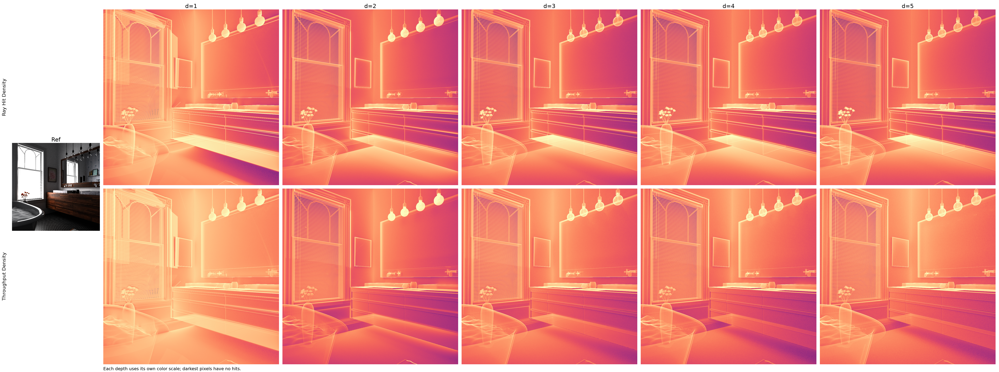

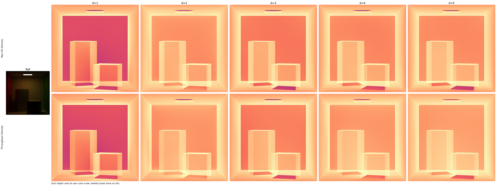

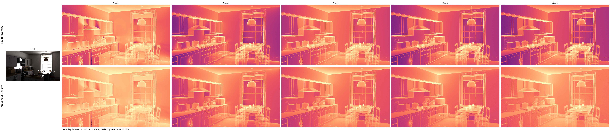

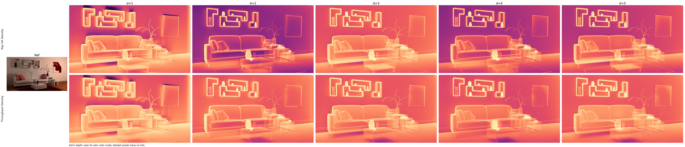

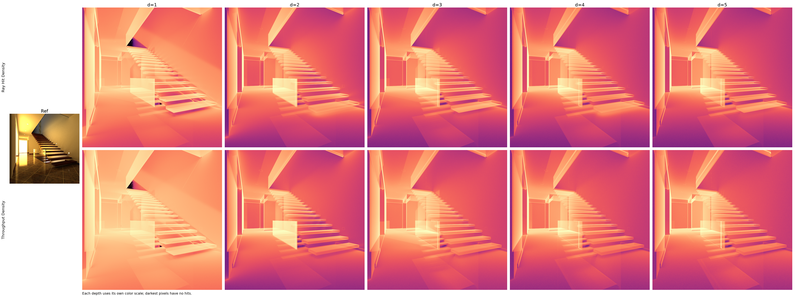

Cornell Box, Kitchen, Staircase와 같은 장면에서는 depth 1에서 depth 5로 증가하더라도 전체적인 spatial distribution의 형태가 크게 달라지지 않았다.

초기 depth에서는 일부 영역의 density 차이가 존재하지만, depth가 증가할수록 인접한 depth 사이의 pattern이 점점 비슷해지는 모습을 확인할 수 있었다.

특히 Cornell Box와 Kitchen에서는 depth 3 이후 Ray Hit Density의 전체적인 구조가 거의 동일하게 유지되었다.

## 3. 복잡한 장면에서의 변화

모든 장면에서 동일한 현상이 나타나는 것은 아니었다.

Car와 Glass of Water에서는 depth가 증가하면서 세부적인 spatial pattern이 계속 변화하였다.

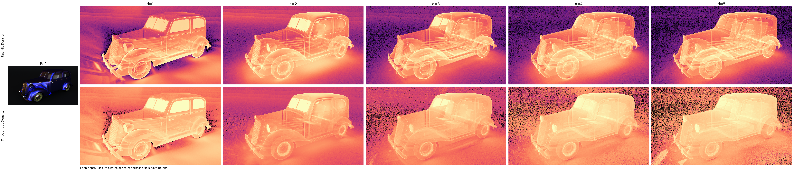

Car에서는 자동차가 차지하는 전체적인 영역은 depth가 증가해도 유지되지만, 내부와 주변의 세밀한 density pattern은 계속 변하였다.

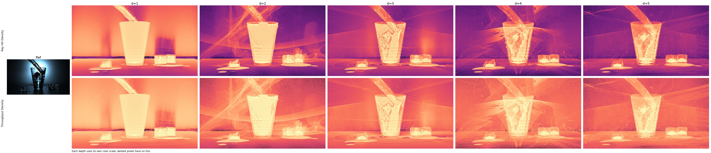

Glass of Water에서는 이러한 변화가 더욱 강하게 나타났다. Glass 내부와 주변에서 depth에 따라 새로운 stripe, shell, overlapping pattern이 나타났으며, 단순히 전체 density가 증가하거나 감소하는 것이 아니라 spatial structure 자체가 변화하였다.

Veach 장면에서도 장면에 따라 서로 다른 형태의 depth 변화가 나타났다.

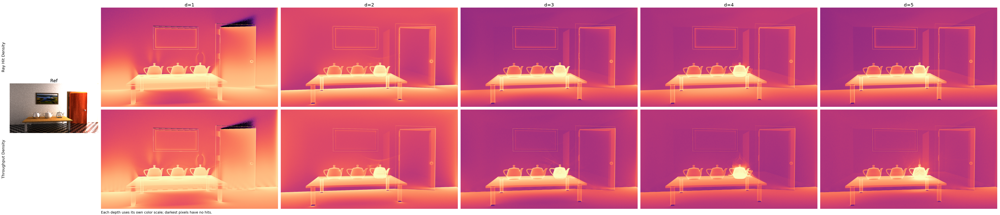

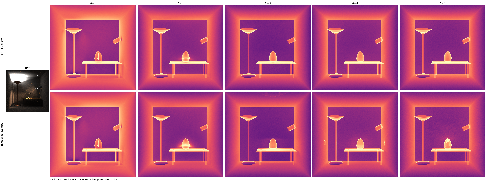

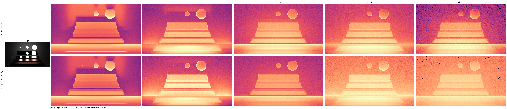

따라서 초기 관찰만으로는 모든 장면에서 동일하게 ray가 특정 위치로 집중된다고 말하기 어렵다.

대신 일부 장면에서는 depth가 증가하면서 distribution이 빠르게 안정되고, 다른 장면에서는 큰 spatial support는 유지하면서 내부의 세부 pattern이 계속 변화하는 모습을 확인하였다.

## 4. EXP03 관찰 결과

EXP03에서 가장 먼저 확인된 것은 path depth별 spatial distribution이 완전히 random하게 변하지 않는다는 점이다.

많은 장면에서 depth가 증가해도 비슷한 geometry와 spatial region이 반복해서 나타났다.

반면 Glass of Water나 Car처럼 복잡한 transport를 포함하는 장면에서는 동일한 큰 영역 안에서도 세부적인 distribution이 depth에 따라 계속 재구성되는 모습을 보였다.

따라서 다음 질문이 생겼다.

서로 인접한 depth의 Ray Hit Distribution은 실제로 얼마나 비슷한가?

이미지만 보고 판단하는 대신, 이 spatial coherence를 수치적으로 확인하기 위해 EXP03-1을 추가로 진행하였다.

# EXP03-1 Adjacent-Depth Spatial Similarity

## 1. 실험 목적

EXP03에서는 여러 장면에서 depth별 Ray Hit Density가 비슷한 spatial structure를 반복해서 가지는 것을 확인하였다.

이번 실험에서는 이러한 관찰이 단순한 시각적 인상인지 확인하기 위해 인접한 depth의 Ray Hit Distribution을 직접 비교하였다.

비교 대상은 다음과 같다.

| 비교 |
| --- |
| depth 1 → depth 2 |
| depth 2 → depth 3 |
| depth 3 → depth 4 |
| depth 4 → depth 5 |

각 depth의 raw hit histogram을 전체 hit 수로 정규화하여 spatial probability distribution으로 변환하였다.

두 distribution 사이의 차이는 JS Divergence와 Cosine Similarity를 이용해 측정하였다.

JS Divergence가 작을수록 두 distribution이 비슷하며, Cosine Similarity는 1에 가까울수록 두 spatial pattern이 비슷하다는 의미이다.

## 2. Adjacent-depth Similarity

전체 10개 장면에서 측정한 native resolution 결과는 다음과 같다.

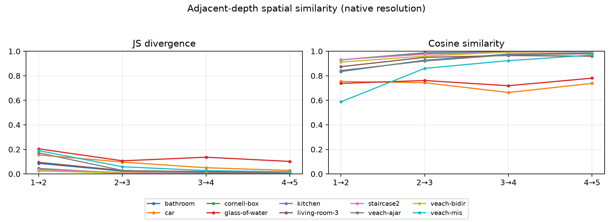

대부분의 장면에서 depth가 증가할수록 JS Divergence가 감소하고 Cosine Similarity가 증가하는 경향이 나타났다.

즉 인접한 depth의 spatial distribution이 점점 비슷해지는 현상이 여러 장면에서 공통적으로 관찰되었다.

대표적인 결과는 다음과 같다.

| Scene | Mean JS | Mean Cosine |
| --- | ---: | ---: |
| bathroom | 0.0319 | 0.9307 |
| car | 0.0827 | 0.7248 |
| cornell-box | 0.0139 | 0.9776 |
| glass-of-water | 0.1375 | 0.7498 |
| kitchen | 0.0137 | 0.9755 |
| living-room-3 | 0.0393 | 0.9372 |
| staircase2 | 0.0138 | 0.9731 |
| veach-ajar | 0.0540 | 0.9284 |
| veach-bidir | 0.0082 | 0.9659 |
| veach-mis | 0.0732 | 0.8352 |

Cornell Box와 Kitchen은 평균 JS Divergence가 약 0.014 수준으로 매우 낮았으며, Cosine Similarity도 약 0.98에 가까웠다.

특히 Cornell Box의 depth 4 → depth 5에서는 JS Divergence가 0.001073, Cosine Similarity가 0.998037이었다.

즉 깊은 depth에서는 두 spatial distribution이 거의 동일한 형태를 가지는 것을 확인하였다.

## 3. Depth에 따른 Spatial Stabilization

여러 일반적인 장면에서 가장 공통적으로 나타난 현상은 depth가 증가하면서 distribution 변화량이 감소한다는 것이었다.

Bathroom의 경우 JS Divergence는 다음과 같이 감소하였다.

| Depth | JS Divergence | Cosine Similarity |
| --- | ---: | ---: |
| 1 → 2 | 0.086194 | 0.835486 |
| 2 → 3 | 0.023407 | 0.926337 |
| 3 → 4 | 0.011281 | 0.976027 |
| 4 → 5 | 0.006717 | 0.985067 |

Cornell Box에서는 이 현상이 더욱 강하게 나타났다.

| Depth | JS Divergence | Cosine Similarity |
| --- | ---: | ---: |
| 1 → 2 | 0.044270 | 0.929792 |
| 2 → 3 | 0.007520 | 0.987887 |
| 3 → 4 | 0.002814 | 0.994689 |
| 4 → 5 | 0.001073 | 0.998037 |

즉 초반 bounce에서는 distribution이 어느 정도 변하지만, depth가 증가할수록 인접 depth 사이의 차이가 빠르게 작아졌다.

현재 실험에서는 이를 depth-wise spatial stabilization 현상으로 관찰하였다.

## 4. Multi-scale 비교

Pixel 단위의 작은 위치 변화 때문에 similarity가 낮게 측정될 가능성을 확인하기 위해 동일한 histogram을 medium과 coarse scale에서도 비교하였다.

Glass of Water와 Car에서 특히 큰 차이가 나타났다.

| Scene | Native Cosine | Coarse Cosine |
| --- | ---: | ---: |
| glass-of-water | 0.7498 | 0.9276 |
| car | 0.7248 | 0.8915 |
| veach-mis | 0.8352 | 0.8719 |
| cornell-box | 0.9776 | 0.9819 |
| kitchen | 0.9755 | 0.9867 |

Glass of Water는 native resolution에서는 평균 Cosine Similarity가 약 0.75였지만 coarse scale에서는 약 0.93까지 증가하였다.

Car 역시 약 0.72에서 약 0.89까지 증가하였다.

이 결과는 해당 장면에서 depth별 세부 pattern은 크게 변하지만, 더 큰 scale에서 보았을 때 spatial support 자체는 상당 부분 유지된다는 것을 의미한다.

즉 완전히 새로운 위치에 random하게 분포하는 것이 아니라, 비슷한 큰 영역 내부에서 세부적인 density structure가 계속 변화하는 형태로 볼 수 있다.

## 5. Glass of Water

Glass of Water는 전체 장면 중 가장 큰 depth 변화가 나타난 장면이었다.

| Depth | Native JS | Native Cosine |
| --- | ---: | ---: |
| 1 → 2 | 0.204726 | 0.738045 |
| 2 → 3 | 0.106945 | 0.761534 |
| 3 → 4 | 0.136195 | 0.719006 |
| 4 → 5 | 0.101966 | 0.780711 |

다른 일반적인 장면처럼 depth가 증가할수록 계속 안정되는 형태는 아니었다.

특히 depth 3 → depth 4에서는 다시 distribution 차이가 증가하였다.

하지만 coarse scale에서는 평균 Cosine Similarity가 0.927649까지 증가하였다.

따라서 Glass of Water에서는 큰 spatial 영역 자체는 유지되지만, 그 내부의 세밀한 distribution이 depth에 따라 반복적으로 재구성되고 있는 것으로 관찰되었다.

## 6. 결론

EXP03에서는 Path Tracing의 각 depth에서 발생한 surface hit들을 camera view로 다시 projection하여 Ray Hit Density와 Throughput Density를 시각화하였다.

그 결과 depth별 distribution이 완전히 독립적으로 변하는 것이 아니라, 여러 장면에서 반복적인 spatial structure를 가지는 것을 확인하였다.

EXP03-1에서는 이러한 관찰을 JS Divergence와 Cosine Similarity를 이용해 정량적으로 확인하였다.

전체적인 결과는 다음과 같다.

- Cornell Box, Kitchen, Staircase와 같은 장면에서는 depth가 증가할수록 adjacent-depth distribution이 빠르게 비슷해졌다.
- 일부 장면에서는 depth 3 이후 거의 동일한 spatial distribution이 유지되었다.
- Glass of Water와 Car에서는 native resolution의 변화가 상대적으로 컸다.
- 하지만 이 장면들도 coarse scale에서는 similarity가 크게 증가하였다.
- 따라서 일부 장면에서는 큰 spatial structure는 유지하면서 작은 scale의 pattern만 depth에 따라 변화하는 현상이 나타났다.

이번 실험에서는 이를 이용한 rendering 방법이나 prediction 방법까지 다루지는 않았다.

현재 단계에서 확인한 것은 Path Tracing의 depth별 surface-hit distribution이 단순한 random pattern만을 가지는 것이 아니라, 장면에 따라 반복적이고 측정 가능한 spatial coherence를 가진다는 것이다.

특히 일반적인 장면에서 나타나는 depth-wise stabilization과, 일부 복잡한 장면에서 나타나는 fine-scale 변화와 coarse-scale coherence의 차이는 추가적으로 분석할 가치가 있는 현상으로 판단하였다.